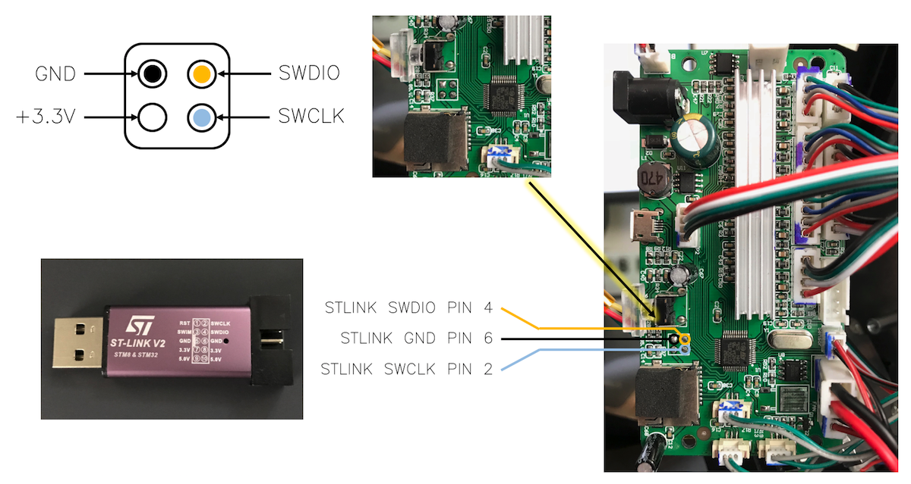

How to flash the Motion Controller with the modified firmware:
========================================================


***WARNING***: This is modified firmware is not supported by anyone. Update at your own risk.

## Install Dependencies

1. Install OpenOCD

	`$ brew install openocd`


## Debug Port Pinout


## Flashing the Printer

Terminal 1: Start OpenOCD Server
------------------------------------------------------------------------------------------------------------------------------
```
$ cd [working directory]
$ openocd -f /usr/local/share/openocd/scripts/interface/stlink-v2.cfg -f /usr/local/share/openocd/scripts/target/stm32f0x.cfg

adapter speed: 1000 kHz
adapter_nsrst_delay: 100
none separate
Info : Unable to match requested speed 1000 kHz, using 950 kHz
Info : Unable to match requested speed 1000 kHz, using 950 kHz
Info : clock speed 950 kHz
Info : STLINK v2 JTAG v17 API v2 SWIM v4 VID 0x0483 PID 0x3748
Info : using stlink api v2
Info : Target voltage: 3.126620
Info : stm32f0x.cpu: hardware has 4 breakpoints, 2 watchpoints
```


Terminal 2: Connect to OpenOCD Server
------------------------------------------------------------------------------------------------------------------------------
```
$ telnet localhost 4444

Trying ::1...
telnet: connect to address ::1: Connection refused
Trying 127.0.0.1...
Connected to localhost.
Escape character is '^]'.
Open On-Chip Debugger

> reset halt

> stm32f0x unlock 0

[power cycle the board]

> stm32f0x mass_erase 0

> flash write_bank 0 hacked_v41.bin 0
```

That's all folks!
